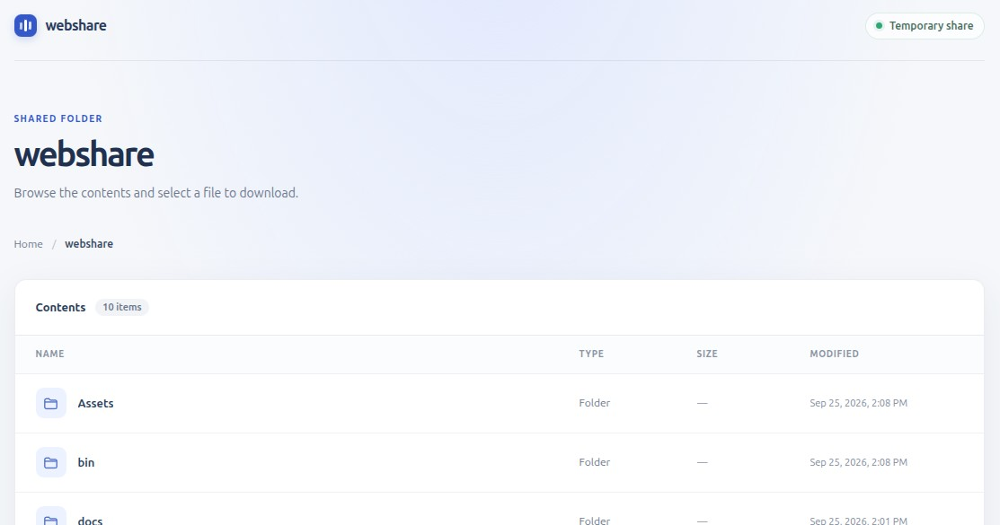

# webshare

Share a file or directory with nearby devices over your local network.

<p align="center">
  
</p>

`webshare` starts a temporary HTTP server, prints its local and network URLs,
and stops when you press Ctrl+C or when its configured duration expires.

## Usage

```sh
webshare <file-or-directory>
webshare [--port <port>] [--time <minutes>] [--open-firewall] <file-or-directory>
```

By default, `webshare` chooses an available port and stops after 60 minutes.
Use `--port` to listen on a specific port (1–65535). Use `--time` to choose the
share duration in minutes; `--time 0` keeps the share active until you press
Ctrl+C.

The app prints the TCP port to allow if other devices cannot connect. Firewall
blocking cannot be reliably detected from the server itself; confirming remote
reachability requires a connection attempt from another device.

Use `--open-firewall` to temporarily allow the selected port through the host
firewall. This requires an elevated terminal (`sudo` on Linux, Administrator
on Windows). On Windows, the rule is limited to the Private profile and local
subnet. On Linux, temporary `iptables`/`ip6tables` rules are limited to the
active local subnets. The rules are removed when the app exits normally;
force-killing the process or losing power can prevent cleanup. On Linux,
`sudo` runs the entire app as root, not just the firewall command; `iptables`
and `ip6tables` must be installed.

```sh
sudo webshare --open-firewall <file-or-directory>
```

On Windows, open PowerShell as Administrator and run the published executable:

```powershell
.\webshare.exe --open-firewall <file-or-directory>
```

Directories are shown in a responsive, styled file listing; selecting a file
downloads it. Sharing a single file opens a styled page with a download button.
The page styling is embedded in the application, so the published binary does
not need a separate asset directory.

## Build and publish

Requires the .NET 10 SDK and GNU Make. The project publishes self-contained
Native AOT binaries. Install the native build prerequisites for your platform:

- Linux: Clang and the zlib development package.
- Windows: Visual Studio Build Tools with the C++ workload and Windows SDK.

Run Make from the project directory:

```sh
make build             # Build for the current platform
make publish           # Publish for the current platform
make publish-linux     # Publish Linux x64
make publish-windows   # Publish Windows x64 (run on Windows)
```

Publishing for a platform requires its native AOT toolchain; publish each
platform on that platform. The resulting executables are written to
`bin/Release/net10.0/linux-x64/publish/webshare` and
`bin/Release/net10.0/win-x64/publish/webshare.exe`.

Install for the current platform with:

```sh
make install
```

On Linux, this installs `webshare` to `/usr/local/bin` (using `sudo` if needed).
On Windows, it copies `webshare.exe` into the project directory alongside the
Makefile; it does not modify PATH. Run it from that directory with
`.\webshare.exe`.

## Network access

The server listens on all network interfaces so other devices on the LAN can
reach it, using the selected or dynamically assigned port. There is no
authentication: anyone able to connect to a displayed address and port can
browse or download the shared content. Use it on a trusted network.

Symbolic links and other reparse points inside a shared directory are not listed
or served.
